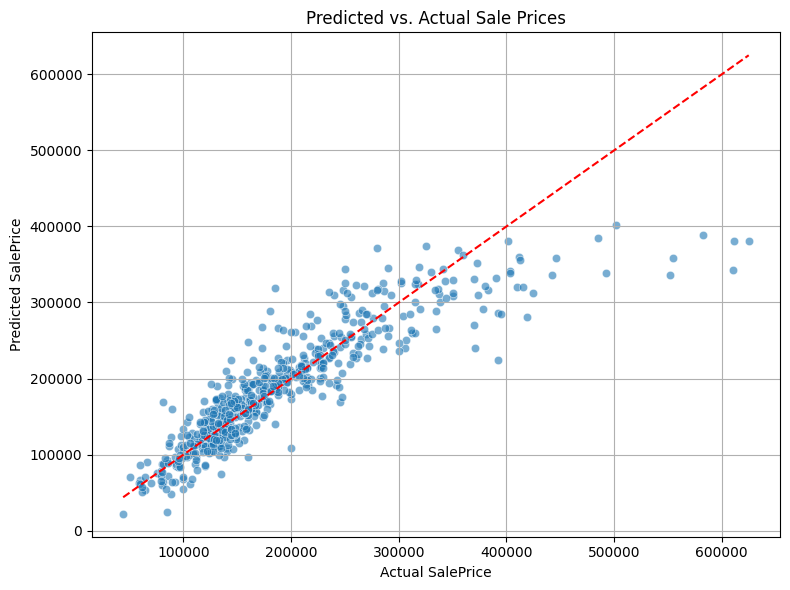
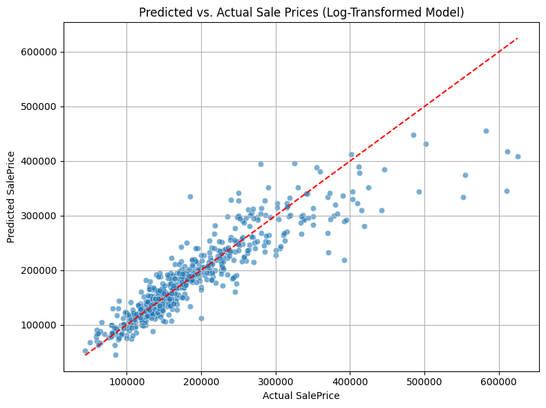

# House Price Prediction Analysis

## Data Preparation and Feature Selection

First, we import the necessary libraries and prepare our dataset by selecting relevant features:
```python
import pandas as pd
import numpy as np
from sklearn.model_selection import train_test_split
from sklearn.compose import ColumnTransformer
from sklearn.preprocessing import OneHotEncoder, StandardScaler
from sklearn.pipeline import Pipeline
from sklearn.linear_model import LinearRegression
from sklearn.metrics import mean_squared_error, r2_score, mean_absolute_error
import matplotlib.pyplot as plt
import seaborn as sns
```
```python

df = pd.read_csv("AmesHousing.csv")
features_to_keep = ['Lot Area', 'Lot Shape', 'House Style', 'Neighborhood', 
                   'Year Built', 'Bsmt Cond', 'Central Air', 'Overall Cond',
                   'Full Bath', 'TotRms AbvGrd', 'Fireplaces', 'Garage Area',
                   'Yr Sold', 'SalePrice']
df = df[features_to_keep]

# Handle missing values
df["Bsmt Cond"] = df["Bsmt Cond"].fillna("None")
df["Garage Area"] = df["Garage Area"].fillna(0)
```

## Model Setup

We set up our machine learning pipeline using scikit-learn:

```python
# Separate features and target
X = df.drop(columns=["SalePrice"])
y = df["SalePrice"]

# Split the data
X_train, X_test, y_train, y_test = train_test_split(X, y, test_size=0.2, random_state=42)

# Define feature types
categorical_cols = ["Lot Shape", "House Style", "Neighborhood", "Bsmt Cond", 
                   "Central Air", "Overall Cond"]
numeric_cols = [col for col in X.columns if col not in categorical_cols]

# Create preprocessing pipeline
preprocessor = ColumnTransformer(
    transformers=[
        ("num", StandardScaler(), numeric_cols),
        ("cat", OneHotEncoder(drop="first", handle_unknown="ignore"), categorical_cols)
    ]
)

# Create full pipeline
model = Pipeline(steps=[
    ("preprocessing", preprocessor),
    ("regressor", LinearRegression())
])
```

## Initial Model Performance

We first tried a basic model with raw sale prices:

```python
model.fit(X_train, y_train)
y_pred = model.predict(X_test)

rmse = np.sqrt(mean_squared_error(y_test, y_pred))
mae = mean_absolute_error(y_test,y_pred)
r2 = r2_score(y_test, y_pred)

print(f"Root Mean Squared Error: {rmse:.2f}")
print(f"Mean Absolute Error: {mae:.2f}")
print(f"R-squared: {r2:.4f}")
```
```output
Root Mean Squared Error: 43125.89
Mean Absolute Error: 26243.98
R-squared: 0.8234
```
Here we show how the predictions fall compared to the actual sale prices for the test data:
  
We notice that the model does relatively well for most price ranges except for the large sale prices.
## Improved Model with Log Transformation

To handle the skewed nature of house prices, we applied a log transformation:

```python

# Log-transform the target
y_train_log = np.log1p(y_train)
y_test_log = np.log1p(y_test)

# Fit model on log-transformed target
model.fit(X_train, y_train_log)

# Predict and inverse-transform
y_pred_log = model.predict(X_test)
y_pred = np.expm1(y_pred_log)

# Calculate final RMSE
rmse2 = np.sqrt(mean_squared_error(y_test, y_pred))
mae2 = mean_absolute_error(y_test_original,y_pred_original)
r2_2 = r2_score(y_test_original, y_pred_original)
print(f"Root Mean Squared Error: {rmse2:.2f}")
print(f"Mean Absolute Error: {mae2:.2f}")
print(f"Root Mean Squared Error: {r2_2:.4f}")
```
```output
Root Mean Squared Error (RMSE): 38104.20
Mean Absolute Error: 23649.70
R-squared: 0.8189
```
The RMSE decreases and R-squared decreases very slightly.


