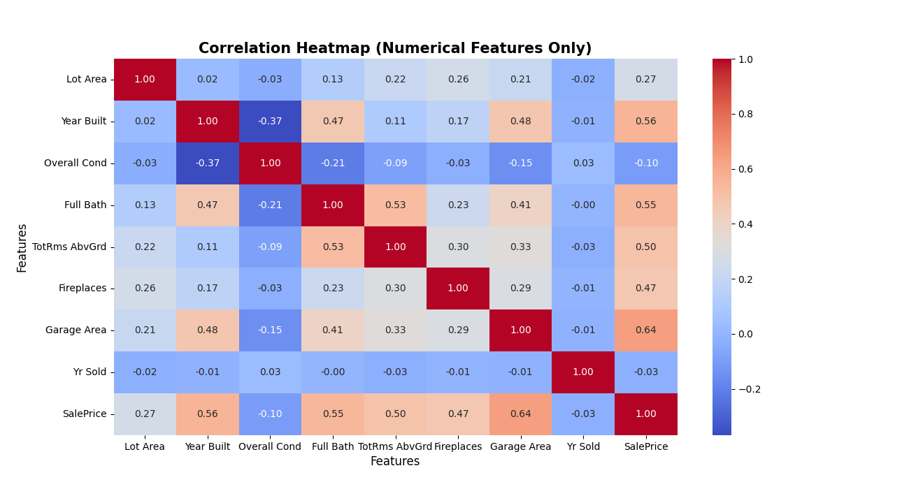
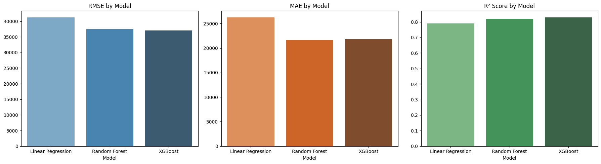
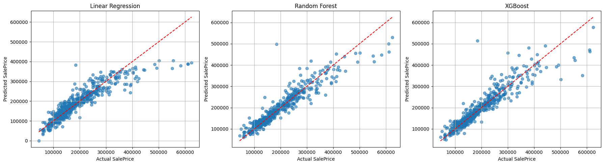

# House Price Prediction Analysis Using Ames Housing Dataset

## Data Preparation and Feature Selection

First, we import the necessary libraries and prepare our dataset by selecting relevant features:
```python
import pandas as pd
import numpy as np
from sklearn.model_selection import train_test_split
from sklearn.compose import ColumnTransformer
from sklearn.preprocessing import OneHotEncoder, StandardScaler
from sklearn.pipeline import Pipeline
from sklearn.linear_model import LinearRegression
from sklearn.metrics import mean_squared_error, r2_score, mean_absolute_error
import matplotlib.pyplot as plt
import seaborn as sns
```
Next, we take a look at the features that are included in this dataset.
```python
df.columns
```
```output
Index(['Order', 'PID', 'MS SubClass', 'MS Zoning', 'Lot Frontage', 'Lot Area',
       'Street', 'Alley', 'Lot Shape', 'Land Contour', 'Utilities',
       'Lot Config', 'Land Slope', 'Neighborhood', 'Condition 1',
       'Condition 2', 'Bldg Type', 'House Style', 'Overall Qual',
       'Overall Cond', 'Year Built', 'Year Remod/Add', 'Roof Style',
       'Roof Matl', 'Exterior 1st', 'Exterior 2nd', 'Mas Vnr Type',
       'Mas Vnr Area', 'Exter Qual', 'Exter Cond', 'Foundation', 'Bsmt Qual',
       'Bsmt Cond', 'Bsmt Exposure', 'BsmtFin Type 1', 'BsmtFin SF 1',
       'BsmtFin Type 2', 'BsmtFin SF 2', 'Bsmt Unf SF', 'Total Bsmt SF',
       'Heating', 'Heating QC', 'Central Air', 'Electrical', '1st Flr SF',
       '2nd Flr SF', 'Low Qual Fin SF', 'Gr Liv Area', 'Bsmt Full Bath',
       'Bsmt Half Bath', 'Full Bath', 'Half Bath', 'Bedroom AbvGr',
       'Kitchen AbvGr', 'Kitchen Qual', 'TotRms AbvGrd', 'Functional',
       'Fireplaces', 'Fireplace Qu', 'Garage Type', 'Garage Yr Blt',
       'Garage Finish', 'Garage Cars', 'Garage Area', 'Garage Qual',
       'Garage Cond', 'Paved Drive', 'Wood Deck SF', 'Open Porch SF',
       'Enclosed Porch', '3Ssn Porch', 'Screen Porch', 'Pool Area', 'Pool QC',
       'Fence', 'Misc Feature', 'Misc Val', 'Mo Sold', 'Yr Sold', 'Sale Type',
       'Sale Condition', 'SalePrice'],
      dtype='object')
```
To simplify our study, we only select the features that can have the most impact in a house sale price. We expect neighborhood, condition, and the size of the house including square footage and number of bedrooms to have the biggest impact. On that note, we select the following features to be included in our study. 

```python

df = pd.read_csv("AmesHousing.csv")
features_to_keep = ['Lot Area', 'Lot Shape', 'House Style', 'Neighborhood', 
                   'Year Built', 'Bsmt Cond', 'Central Air', 'Overall Cond',
                   'Full Bath', 'TotRms AbvGrd', 'Fireplaces', 'Garage Area',
                   'Yr Sold', 'SalePrice']
df = df[features_to_keep]
```
Next, we check to see if the features we have selected include any NaN values
```python
print(df.isnull().sum())
```
```output
Lot Area          0
Lot Shape         0
House Style       0
Neighborhood      0
Year Built        0
Bsmt Cond        80
Central Air       0
Overall Cond      0
Full Bath         0
TotRms AbvGrd     0
Fireplaces        0
Garage Area       1
Yr Sold           0
SalePrice         0
dtype: int64
```
We see that Bsmt Cond has 80 such values while Garage Area has one. We choose to turn the Basement Condition ones to None since we do not have information about the basement of those houses and we fill 0 for the Garage Area that is missing.
```python 
# Handle missing values
df["Bsmt Cond"] = df["Bsmt Cond"].fillna("None")
df["Garage Area"] = df["Garage Area"].fillna(0)
```
## Visualizing and analyzing the data
We check the type of data each feature includes. This helps us separate the features between categorical and numerical later on.
```python
df.info()
```
```output
<class 'pandas.core.frame.DataFrame'>
RangeIndex: 2930 entries, 0 to 2929
Data columns (total 14 columns):
 #   Column         Non-Null Count  Dtype  
---  ------         --------------  -----  
 0   Lot Area       2930 non-null   int64  
 1   Lot Shape      2930 non-null   object 
 2   House Style    2930 non-null   object 
 3   Neighborhood   2930 non-null   object 
 4   Year Built     2930 non-null   int64  
 5   Bsmt Cond      2850 non-null   object 
 6   Central Air    2930 non-null   object 
 7   Overall Cond   2930 non-null   int64  
 8   Full Bath      2930 non-null   int64  
 9   TotRms AbvGrd  2930 non-null   int64  
 10  Fireplaces     2930 non-null   int64  
 11  Garage Area    2929 non-null   float64
 12  Yr Sold        2930 non-null   int64  
 13  SalePrice      2930 non-null   int64  
dtypes: float64(1), int64(8), object(5)
memory usage: 320.6+ KB
None
```
We can also check the correlation heatmap for the numerical features that we have to get an idea how related the features are.
```python
num_df = df.select_dtypes(include=['int64','float64'])
correlation_matrix = num_df.corr()
plt.figure(figsize=(13,7))
sns.heatmap(correlation_matrix, cmap ='coolwarm', fmt =".2f", annot=True)
plt.title("Correlation Heatmap for Numerical Features", fontsize=15, fontweight='bold')
plt.xlabel("Features")
plt.ylabel("Features")
plt.show()
```


## Model Setup

We set up our machine learning pipeline using scikit-learn, starting by separating the data into training and testing sets, 80% and 20% respectively.

```python
# Separate features and target
X = df.drop(columns=["SalePrice"])
y = df["SalePrice"]

# Split the data into 80% training data and 20% testing data
X_train, X_test, y_train, y_test = train_test_split(X, y, test_size=0.2, random_state=42)

# Define feature types
categorical_cols = ["Lot Shape", "House Style", "Neighborhood", "Bsmt Cond", 
                   "Central Air"]
numeric_cols = [col for col in X.columns if col not in categorical_cols]

# Transformer for preprocessing
preprocessor = ColumnTransformer(
    transformers=[
        ("num", StandardScaler(), numeric_cols),
        ("cat", OneHotEncoder(drop="first", handle_unknown="ignore"), categorical_cols)
    ]
)
```
## Training and Obtaining the Results

Now, we train three different models to see which of them performs better. We will use Linear Regression, Random Forest Regressor, and XGBRegressor. We will run them all with their default hyperparameter values, but later on, we will show how one can do a search for the hyperparameters through cross validation.

```python
models = {
    "Linear Regression": LinearRegression(),
    "Random Forest": RandomForestRegressor(n_estimators=100,random_state=42),
    "XGBoost": XGBRegressor(random_state=42)
}

results = []

for name, reg in models.items():
    pipeline = Pipeline(steps=[
        ("preprocessing", preprocessor),   # same preprocessor for all
        ("regressor", reg)
    ])
    
    pipeline.fit(X_train, y_train)
    y_pred = pipeline.predict(X_test)
    
    rmse = np.sqrt(mean_squared_error(y_test, y_pred))
    mae = mean_absolute_error(y_test,y_pred)
    r2 = r2_score(y_test, y_pred)
    mape = np.mean(np.abs((y_test - y_pred) / y_test)) * 100
    mpe = np.mean((y_test - y_pred) / y_test) * 100

    results.append({
        "Model": name,
        "RMSE": rmse,
        "MAE": mae,
        "R²": r2,
        "MAPE (%)": mape,
        "MPE (%)": mpe
    })

# Convert to DataFrame for comparison
results_df = pd.DataFrame(results).sort_values(by="RMSE")
print(results_df)
```
```output
               Model      RMSE       MAE    R²     MAPE (%)  MPE (%)
2            XGBoost  37071.42  21795.56  0.83     11.32    -2.56
1      Random Forest  37533.28  21647.81  0.82     11.37    -3.54
0  Linear Regression  41276.68  26285.24  0.79     13.71    -1.49

```

We can see that XGBoost and Random Forest perform almost identically with all the metrics being close between the two models. Linear regression seems to do relatively worse which indicates nonlinearities in the data.

## Visualizing the Results

We now visualize the difference between the three models used with some graphs.

```python
results_df = pd.DataFrame(results)

# Set figure size and create subplots
fig, axes = plt.subplots(1, 3, figsize=(18, 5))

# Plot RMSE
sns.barplot(ax=axes[0], data=results_df, x="Model", y="RMSE", palette="Blues_d")
axes[0].set_title("RMSE by Model")

# Plot MAE
sns.barplot(ax=axes[1], data=results_df, x="Model", y="MAE", palette="Oranges_d")
axes[1].set_title("MAE by Model")

# Plot R²
sns.barplot(ax=axes[2], data=results_df, x="Model", y="R²", palette="Greens_d")
axes[2].set_title("R² Score by Model")

# Clean up layout
for ax in axes:
    ax.set_xlabel("Model")
    ax.set_ylabel("")

plt.tight_layout()
plt.show()
```


Finally, we visualize the predicted sale price versus the actual sale price for the houses for all three models. 


## Bonus: An Example of Searching for Best Hyperparameters using Cross-Validation

Here, we do a grid search for different combinations of hyperparameter values for the Random Forest model. Something similar can be done for other models. 

```python
# Here, you can add different values for the hyperparameters as desired. I am keeping this to a smaller grid to conserve time.
param_grid = {
    "regressor__n_estimators": [50,100,200],
    "regressor__max_depth": [None,5, 10, 20],
    "regressor__min_samples_split": [2, 5],
    "regressor__min_samples_leaf": [1, 2],
}
rf_model = Pipeline(steps=[
    ("preprocessing", preprocessor),
    ("regressor", RandomForestRegressor(random_state=42))
])

search = GridSearchCV(
    rf_model,               
    param_grid,              # search space
    cv=5,                    # 5-fold cross-validation
    scoring="neg_root_mean_squared_error",  # you can also use "r2" or other scoring methods
    n_jobs=-1,               # use all CPU cores
    verbose=2
)

search.fit(X_train, y_train)
print("Best parameters:", search.best_params_)
print("Best RMSE score (CV):", -search.best_score_)

# Use best model on test set
best_model = search.best_estimator_
y_pred_best = best_model.predict(X_test)
test_rmse = np.sqrt(mean_squared_error(y_test, y_pred_best))
print("Test RMSE:", test_rmse)
```

```output
Fitting 5 folds for each of 48 candidates, totalling 240 fits
Best parameters: {'regressor__max_depth': None, 'regressor__min_samples_leaf': 1, 'regressor__min_samples_split': 2, 'regressor__n_estimators': 200}
Best RMSE score (CV): 33093.26205907554
Test RMSE: 37657.02820955306
```
