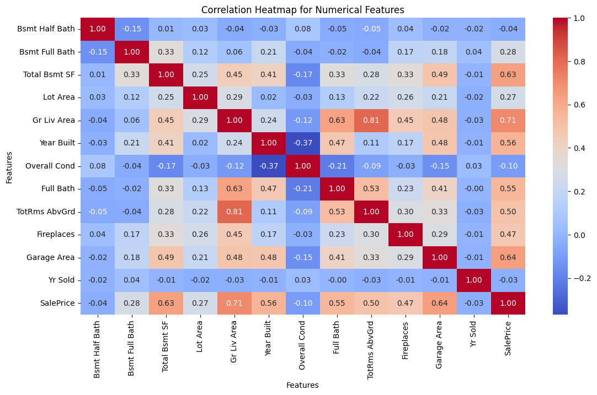
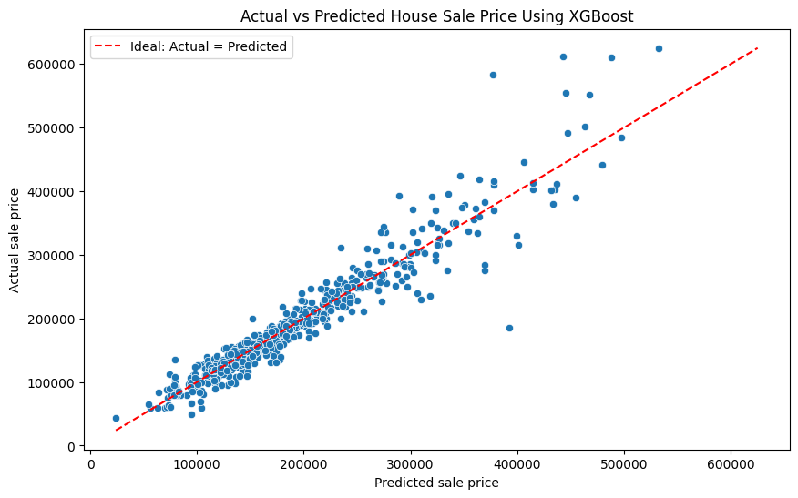

# House Price Prediction: A Machine Learning Analysis

## Project Overview

This presentation showcases an analysis of house price prediction using multiple machine learning approaches, from traditional algorithms to a deep neural network. The project demonstrates the entire ML pipeline from data preprocessing to model evaluation and comparison. This project uses the Ames Housing dataset from [Kaggle](https://www.kaggle.com/datasets/shashanknecrothapa/ames-housing-dataset).

---

## Objectives

- Implement proper data preprocessing and feature engineering
- Predict house sale prices using various machine learning models
- Compare performance across different algorithms:
  - Linear Regression
  - Random Forest
  - XGBoost
  - Neural Networks (PyTorch)
- Evaluate models using multiple metrics (RMSE, MAE, R², MAPE)


---

##  Dataset Overview

**Source**: Ames Housing Dataset  
**Target Variable**: SalePrice

### Selected Features (19 total):
- **Numerical Features**: Lot Area, Total Basement SF, Garage Area, Living Area, Year Built, etc.
- **Categorical Features**: Lot Shape, House Style, Neighborhood, Central Air
- **Ordinal Features**: Basement Condition, Kitchen Quality

### Data Preprocessing Steps:
1. **Missing Value Handling**:
   - Basement Condition: Filled with "None" (no basement)
   - Numerical basement/garage features: Filled with 0. Here, we assumed missing info means the house does not have a basement/garage.
2. **Feature Engineering**:
   - Separated categorical, ordinal, and numerical features
   - Applied appropriate encoders for each feature type

---

## 🔍 Exploratory Data Analysis

### Correlation Analysis
- Created correlation heatmap for numerical features
- Identified relationships between features and target variable
- Used insights to guide feature selection and engineering   
   


```python
# Correlation matrix visualization
numerical_df = df.select_dtypes(include=np.number)
correlation_matrix = numerical_df.corr()
sns.heatmap(correlation_matrix, annot=True, cmap='coolwarm')
```

---

##  Data Preprocessing Pipeline

### Preprocessing Strategy:
```python
# Separate preprocessing for different feature types
categorical_transformer = OneHotEncoder(handle_unknown='ignore')
ordinal_transformer = OrdinalEncoder(categories=ordinal_categories)
numeric_transformer = StandardScaler()

# Combined preprocessing pipeline
preprocessor = ColumnTransformer([
    ("num", numeric_transformer, numerical_cols),
    ("cat", categorical_transformer, categorical_cols),
    ("ord", ordinal_transformer, ordinal_cols)
])
```

### Train-Test Split:
- **Training Set**: 80% of data
- **Test Set**: 20% of data
- **Random State**: 42 (for reproducibility)

---

## Model 1: Linear Regression

### Implementation:
- Simple baseline model using scikit-learn
- Combined with preprocessing pipeline
- Direct implementation without hyperparameter tuning

### Results:
```
Model: Linear Regression
RMSE: [37938.93]
MAE: [23782.83]
R²: [0.820]
MAPE(%): [12.62]
```

### Visualization:
- Scatter plot of predicted vs actual prices
- Ideal prediction line (y=x) for reference
- Assessment of prediction accuracy and bias


---

##  Model 2: Random Forest

### Hyperparameter Optimization:
Used GridSearchCV with 5-fold cross-validation to optimize:
- **n_estimators**: [50, 100, 150, 200]
- **max_depth**: [None, 5, 10]
- **min_samples_split**: [2, 5, 10]
- **min_samples_leaf**: [1, 2]

### Best Parameters Found:
```
{'regressor__max_depth': None, 'regressor__min_samples_leaf': 1, 'regressor__min_samples_split': 2, 'regressor__n_estimators': 150}
```

### Performance:
```
Model: Random Forest
RMSE: [30458.84]
MAE: [17866.83]
R²: [0.884]
MAPE(%): [9.70]
```
### Visualization:
- Scatter plot of predicted vs actual prices
- Ideal prediction line (y=x) for reference
- Assessment of prediction accuracy and bias
---


##  Model 3: XGBoost

### Advanced Hyperparameter Tuning:
Comprehensive grid search across multiple parameters:
- **n_estimators**: [100, 200, 300, 350, 400]
- **max_depth**: [3, 5, 7]
- **learning_rate**: [0.01, 0.05, 0.1, 0.15]
- **subsample**: [0.8, 1.0]
- **colsample_bytree**: [0.8, 1.0]

### Best Parameters Found:
```
{'regressor__colsample_bytree': 0.8, 'regressor__learning_rate': 0.1, 'regressor__max_depth': 3, 'regressor__n_estimators': 400, 'regressor__subsample': 1.0}

```

### Optimization Strategy:
- Cross-validation with negative RMSE scoring
- Parallel processing for efficiency


### Performance Results:
```
Model: XGBoost
RMSE: [28577.19]
MAE: [18003.51]
R²: [0.898]
MAPE(%): [9.87]
```
### Visualization:
- Scatter plot of predicted vs actual prices
- Ideal prediction line (y=x) for reference
- Assessment of prediction accuracy and bias
---


---

##  Model 4: Neural Network (PyTorch)

### Architecture Exploration:
Tested multiple neural network architectures:
1.  A hidden layer with 32 neurons
2.  A hidden layer with 64 neurons and a second hidden layer of 32 neurons
3.  A hidden layer with 128 neurons and a second hidden layer of 64 neurons

### Implementation Details:
- **Framework**: PyTorch
- **Activation**: ReLU
- **Regularization**: Dropout (0.2)
- **Optimizer**: Adam (lr=0.001)
- **Loss Function**: MSE
- **Epochs**: 200
- **Batch Size**: 64


### Best Architecture Results:
```
Architecture: [64, 32]
RMSE: [25523.54]
R²: [0.918]
MAE: [16935.51]
MAPE(%): [9.24]
```

---

## 📊 Model Comparison & Results

### Performance Summary:


| Model                |   RMSE   |  R²   |    MAE   | MAPE(%)|   
|----------------------|----------|-------|----------|--------| 
NeuralNet [64, 32]     | 25523.54 | 0.918 | 16935.51 |  9.24  |                                        
XGBoost                | 28577.19 | 0.898 | 18003.51 |  9.87  |
Random Forest          | 30458.84 | 0.884 | 17866.83 |  9.70  |
Linear Regression      | 37938.93 | 0.820 | 23782.83 |  12.62 |
### Key Insights:
- **Best Performing Model**: [Model name based on results]
- **Most Complex**: Neural Network with multiple architectures
- **Baseline**: Linear Regression provides good starting point

---

## 📈 Visualization Analysis

### Prediction Accuracy Plots:
For each model, we created scatter plots showing:
- **X-axis**: Predicted house prices
- **Y-axis**: Actual house prices
- **Red dashed line**: Perfect prediction line (y=x)
- **Analysis**: Closer points to the line indicate better predictions


---

## Technical Implementation Highlights

### Code Quality Features:
1. **Reproducibility**: Set random seeds for consistent results
2. **Modular Design**: Separate preprocessing and modeling pipelines
3. **Error Handling**: Proper missing value treatment
4. **Scalability**: Efficient grid search with parallel processing

### Advanced Techniques:
- **Feature Engineering**: Ordinal encoding for ranked categorical variables
- **Pipeline Integration**: Seamless preprocessing and modeling
- **Hyperparameter Optimization**: Systematic search strategies
- **Deep Learning**: Custom PyTorch neural network implementation

---

## Key Takeaways

### Model Performance:
1. **Ensemble Methods** (Random Forest, XGBoost) typically outperform simple linear models
2. **Hyperparameter Tuning** significantly improves model performance
3. **Neural Networks** can capture complex patterns but require careful tuning
4. **Proper Preprocessing** is crucial for all model types

---

##  Future Improvements

### Potential Enhancements:
1. **Feature Engineering**: Create new features from existing ones
2. **Advanced Architectures**: Try CNN or transformer models
3. **Ensemble Methods**: Combine multiple models for better predictions
4. **Cross-Validation**: Implement k-fold CV for more robust evaluation
5. **Feature Selection**: Use techniques like LASSO or feature importance
6. **Hyperparameter Optimization**: Try Bayesian optimization

### Deployment Considerations:
- Model serialization and saving
- API development for real-time predictions
- Performance monitoring in production
- Model retraining strategies

---

##  Libraries & Technologies Used

### Core Libraries:
- **pandas**: Data manipulation and analysis
- **numpy**: Numerical computations
- **scikit-learn**: Traditional ML algorithms and preprocessing
- **xgboost**: Gradient boosting implementation
- **pytorch**: Deep learning framework

### Visualization:
- **matplotlib**: Basic plotting
- **seaborn**: Statistical visualizations

### Key Modules:
- **sklearn.model_selection**: Train-test split, GridSearchCV
- **sklearn.preprocessing**: Scalers and encoders
- **sklearn.metrics**: Model evaluation metrics
- **torch.nn**: Neural network building blocks

---

##  Conclusion

This comprehensive analysis demonstrates the power of multiple machine learning approaches for regression problems. Each model brings unique strengths:

- **Linear Regression**: Simple, interpretable baseline
- **Random Forest**: Robust ensemble method with good performance
- **XGBoost**: Gradient boosting with excellent results
- **Neural Networks**: Flexible deep learning approach with high potential

The project showcases end-to-end machine learning workflow from data preprocessing to model evaluation, providing a solid foundation for house price prediction and demonstrating best practices in ML model development and comparison.

---

*Project completed using Python 3.13.2*
